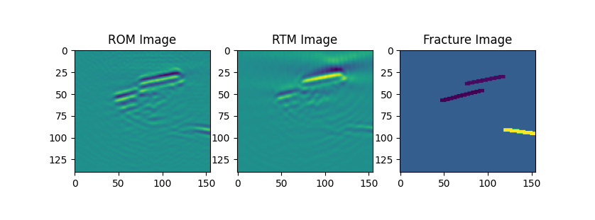

# Removal of Imaging Artifacts with Neural Networks

## Background
Array imaging is at the core of many applications, for instance, medical ultrasound, non destructive testing or radar imaging. An array is a collection of sources and receivers that emit probing pulses into an unknown object and measure scattered returns. In imaging, one tries to locate variation of the coefficients of the governing partial differential equation of the probed medium.

To be computationally tractable, many imaging methods make crude approximations, such as the single-scattering approximation, which assumes that a wave only scatters once inside the unknown object. This leads to imaging artifacts typically visible as ”ghost objects”. One classical imaging algorithm that makes this assumption is
reverse-time migration RTM. In this project the classical approach of using RTM will be compared to [recently published imaging algorithm that takes multiple scattering into account](https://arxiv.org/pdf/2108.01609.pdf). This algorithm is refered to as ROM-imaging algorithm as it uses reduced-order model approximations of the wave-dynamics to form an image.

## Project Goal
The goal of this project is to train a neural network to remove some of these imaging artifacts produced by RTM and ROM. A separate neural network will be trained for the RTM-imaging algorithm and the ROM-imaging algorithm. The two central questions that we try to answer are:
1. Is it easier to remove artifacts introduced by the RTM algorithm or by the ROM algorithm?
2. Do the type of artifacts introduced by the RTM and ROM imaging algoriothm require different network architectures?

## RTM, ROM and Wave Solver
This repository contains a implementation of RTM and ROM in Python. Furthermore a Wave Solver for simulating the behavior of the waves in the fractured medium is provided. Both imaging algorithms and the Wave solver can be accelerated by using Nvidia GPUs. The project utilizes [CuPy](https://cupy.dev/) for GPU-acceleration. The code was primarily written for execution on the [UPPMAX](https://www.uppmax.uu.se/) cluster of Uppsala University. 

  

## Generating Fractures
In order to supply input to RTM and ROM fracture images need to be produced. Theses images are generated with the fracture generator. The generator is capable of producing five different types of fractures, which get placed arbitrarily in the image:
- **Single Fractures:** simple straigt line
- **Double Fractures:** two parallel (or almost parallel) lines close to each other
- **Y-Fractures:** fractures in the shape of a Y
- **Plygon-Fractures:** line that it randomly shaped. This is the most realistic kind of fracture
- **Point Targets:** simple point. This is mainly used for testing
